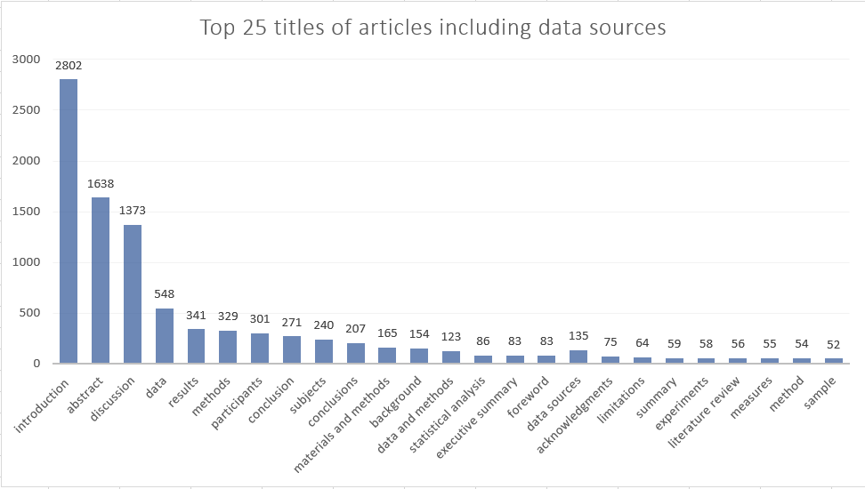

# Kaggle_competition

This challenge was proposed by ...

To get better insight within data, I had three EDAs. EDAs are really necessary to check which approaches can be proper for next steps: ([EDA.py](https://github.com/shivaShahsavari/Kaggle_competition/blob/main/EDA.py))  
## EDA  
### 1) Analysis 1  
In first analysis, idea of topic classification using CNN with different kernels is explored. So, you can see in EDA file that min and max number of words in data sources name are 1 and 17. Unfortunately, Kernel lengths in range of 1-17 needs 62 GB RAM to run on training dataset.  
**result:  
max length of label: 17  
Data source name with max length: "National Center for Science and Engineering Statistics Survey of Graduate Students and Postdoctorates in Science and Engineering  
min length of label: 1  
Data source name with min length: ADNI**  

### 2) Analysis 2  
Since text of articles are too much, text summarization idea came to my mind. So, I checked how many titles of articles including data source names. If their numbers are a few, I could get rid of rest parts and focus only on text with mentioned titles. You can see top 25 articles including data sources name. 

  

Total distinct titles of articles are 12828 and if we chose top 30 articles, around 10064 of 19662 articles will not be involved in modeling. By further look at data, 9934 files will be missed considering 40 top articles. So, this approach is not suitable as well.  
**result:  
number of files not in top 30 titles:  10064  
number of files not in top 40 titles:  9938**  

### 3) Analysis 3  
Transforming sentences to vectors by using Bert algorithm and calculating cosine similarity between vectors is another possible approach. The reuslt of this possible solution indicates that similarity between transformed vectors are not considerable. Considering threshold of 40% similarity, even low value, results in 5519 articles disregarded.  
**result:  
number of articles contains key and sim <40 :  5519**  

## Preprocessing  
Based on previous analysis, sentence similarity was the main proper idea in my opinion. Just I had to check other related options. To follow this idea, data should be precessed at first. In process.py file, I gathered all of the sentences including data sources name with their related classes as training data set. According to my experience, the best structure to save a lot of sentences was pickle in comparison to excel. This structure is not suggested solution, if you concern about readability and security. But, if you want to save data quickly and later upload them to use, I strongly recommend it.([preprocess.py](https://github.com/shivaShahsavari/Kaggle_competition/blob/main/prepocess.py))  
Note: FYI, you can save pickle format of 57000 records in 30 mins and in csv format, more than 8 hours.   

## Modeling  
The simplest modeling is cosine similarity between sentences by their common words which calculates quickly without using RAM that much but accuracy is super low. ([sentence_similarity_words.py](https://github.com/shivaShahsavari/Kaggle_competition/blob/main/sentence_similarity_words.py))  
The next modelling is transforming sentences by "quora-distilbert" pre_model, indexing transformed data by "hnswlib" library and then finding KNN vectorsto the test sentences. This approach has highest accuracy. The predictions were correct in Kaggle competition but took exceeded RAM usage. ([vector_similarity_knn.py](https://github.com/shivaShahsavari/Kaggle_competition/blob/main/vector_similarity_knn.py))
